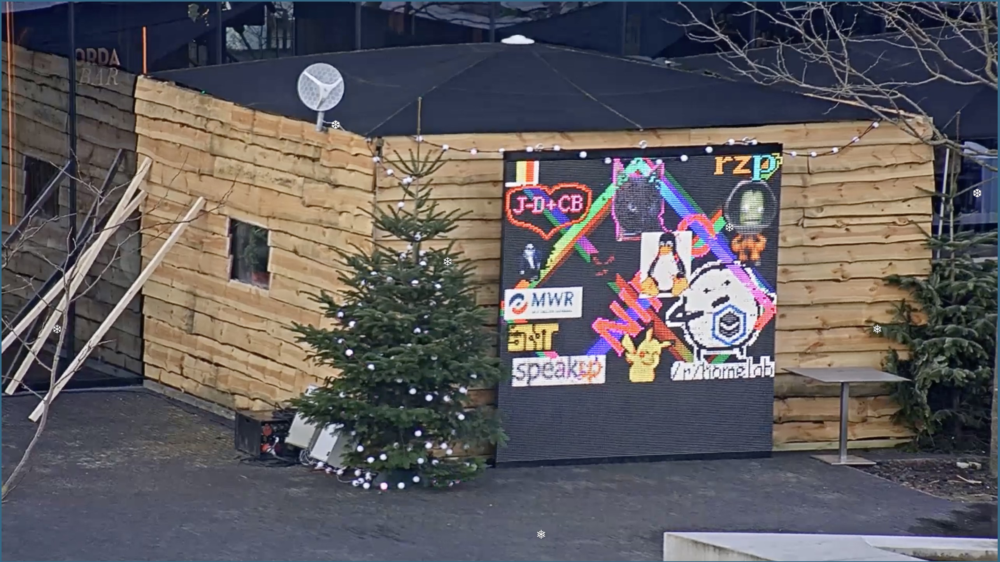

# jingleping-go

Ping images to the [IPv6 christmas tree](https://jinglepings.com). I wrote this application to draw a dabbing Pikachu and a dancing Sans to the video wall. Check the [Releases](https://github.com/ajmadsen/jingleping-go/releases) page for downloads.



# Usage

```
Usage of ./jingleping-go:
  -dst-net string
    	the destination network of the ipv6 tree (default "2001:4c08:2028")
  -image string
    	the image to ping to the tree
  -rate int
    	how many times to draw the image per second (default 5)
  -workers int
    	the number of workers to use (default 1)
  -x int
    	the x offset to draw the image
  -y int
    	the y offset to draw the image
```

If the image is an animated GIF, the rate should be adjusted accordingly. By default, the application will send one ping per pixel per frame. If the rate is set to some value higher than the average frame delay, each pixel in the frame may be sent more than once, improving the fidelity of the animation.

# Building

You'll need Go (preferably 1.11 for module support). Clone the repository somewhere outside your `$GOPATH`, and run `go build`.

```
$ cd /tmp
$ git clone https://github.com/ajmadsen/jingleping-go
$ cd jingleping-go
$ go build
$ ./jingleping-go ...
```

Alternatively, run `go get -u github.com/ajmadsen/jingleping-go` to install to your `$GOPATH`, and find the installed binary at `$GOPATH/bin/jingleping-go`.
